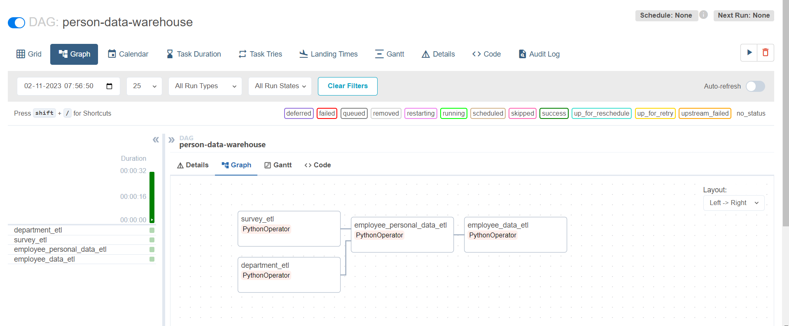

# Employee Data Warehouse And Analytics | Modern Data Engineering GCP Project

## Introduction

The goal of this project is to create a data warehouse of a MNC Employee data using various tools and technologies, including GCP Storage, Python, Compute Instance, Apache Airflow, BigQuery, and Looker Studio.
for analysis 

## Architecture 

## Technology Used
- Programming Language - Python

Google Cloud Platform
1. Google Storage
2. Compute Instance 
3. BigQuery
4. Looker Studio

Data Pipeine Tool - Apache Airflow

## Data Model

## Airflow DAG

